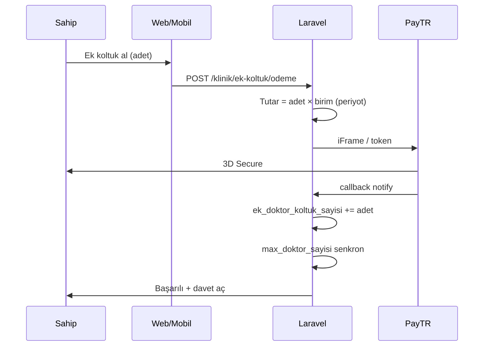

# Klinik Ek Hekim Koltuğu  
## Ürün & Teknik Plan Sunumu

**Randevu Ajandam** · Planlama dokümanı  
**Tarih:** 2026-07-22  
**Durum:** Plan — 3 açık nokta kapatıldı; Faz 1’e hazır  
**Hedef:** Klinik paket limitinin üstünde, ücretli ek hekim koltuğu modeli  

### Onaylanan kararlar (özet)
| Madde | Karar |
|-------|--------|
| Ek hekim birim (aylık) | 1.000 ₺ |
| Ek hekim birim (yıllık) | 10.000 ₺ |
| Özel Web / Kurumsal **hekim** tavanı | **20** (999 / “sınırsız” yok) |
| Özel Web / Kurumsal **personel** tavanı | **10** (999 / “sınırsız” yok) |
| 20 hekim üstü | Ek hekim koltuğu (1.000 ₺/ay · 10.000 ₺/yıl) |
| Ara dönem fiyat | **Tam birim ücret** (pro-rata yok); bitiş = `uyelik_bitis` |
| Ara dönem UI | **Zorunlu şeffaflık:** kalan gün + “bu tutar X gün için geçerlidir” uyarısı |
| Abonelik bitince (grace) | **Grace yok (Faz 1).** Yeni davet kapalı; mevcut hekim paneli açık; banner |
| Ek koltuk süresi | Ana klinik aboneliğe kilitli; ayrı “koltuk grace” yok |

---

## 1. Amaç

Klinik paketlerinde hekim kotası sabittir (ör. Başlangıç = 3).  
Bazı klinikler paketi yükseltmeden **1–2 hekim daha** eklemek ister.

**Çözüm:** Paket **dahil kontenjanı** koru; limit üstü her hekim için **ayrı ücretli koltuk** sat.

> Paket yükseltmek zorunda kalmadan, kontrollü ve faturalanabilir büyüme.

---

## 2. Bugünkü durum

| Kavram | Şu an |
|--------|--------|
| Limit kaynağı | `paketler.max_doktor_sayisi` → kliniğe yansır |
| Kontrol | `klinikler.max_doktor_sayisi` + `doktorLimitiDolduMu()` |
| Limit dolunca | Davet / ekleme **tamamen kapalı** |
| Ara seçenek | Yok (ya paket yükselt, ya ekleme) |

### Paket tavanları (plan — kilitli)

| Klinik paket | Dahil hekim | Dahil personel | Not |
|--------------|-------------|----------------|-----|
| Başlangıç | 3 | 1 | |
| Plus | 6 | 2 | |
| Profesyonel | 10 | 5 | |
| **Özel Web / Kurumsal** | **20** | **10** | Eski 999 hekim + 999 personel kalkar |

**Kurumsal personel kararı (kilitli):**  
`max_personel_sayisi = 10` — hekim tavanının yarısı.  
Gerekçe: sekreter/muhasebe/çağrı oranı hekimden düşük; “20 hekim = 20 personel” şişirme.  
Personel için ek koltuk **Faz 3**; Faz 1’de personel 10’da kilitlenir, aşımda yeni personel ekleme kapalı (mevcut personel paneli açık).

**Hekim ek koltuk:** Tüm paketlerde (3 / 6 / 10 / 20 dahil bittiğinde).  
Vitrin: “Sınırsız” yok → **“20 hekime / 10 personele kadar”**.

---

## 3. İş modeli (öneri)

### 3.1 İki katmanlı kota

```
Efektif limit = Paket dahil hekim + Satın alınan ek koltuk
```

| Örnek | Hesap |
|-------|--------|
| Başlangıç, ek yok | 3 + 0 = **3** |
| Başlangıç + 1 koltuk | 3 + 1 = **4** |
| Başlangıç + 2 koltuk | 3 + 2 = **5** |
| Plus + 1 koltuk | 6 + 1 = **7** |
| Kurumsal, ek yok | 20 + 0 = **20** |
| Kurumsal + 2 koltuk | 20 + 2 = **22** |

### 3.2 Fiyat (öneri — sabit birim)

| Periyot | Birim fiyat (ek hekim / koltuk) | Not |
|---------|----------------------------------|-----|
| **Aylık** | **1.000 ₺** | Tüm klinik paketlerde aynı |
| **Yıllık** | **10.000 ₺** | ≈ %17 indirim (12×1000 yerine 10.000) |

**Neden sabit birim?**
- Anlaşılır pazarlama: “Ek hekim = 1.000 ₺/ay”
- Paket matrisini şişirmez
- Muhasebe / PayTR kalemi sade

**İleride (opsiyonel):** Pakete göre farklı fiyat admin’den değiştirilebilir alanlarla.

### 3.3 Periyot kuralı (öneri)

> Ek koltuk periyodu = **klinik abonelik periyodu** ile aynı.

- Klinik aylıksa → ek koltuk aylık  
- Klinik yıllıksa → ek koltuk yıllık  

**Gerekçe:** Farklı bitiş tarihleri ve “hangi koltuk ne zaman biter” karmaşası olmaz.

### 3.4 Ara dönem alımı (kilitli: tam ücret + şeffaf UI)

| Madde | Karar |
|-------|--------|
| Fiyat | **Tam birim** (aylık 1.000 ₺ veya yıllık 10.000 ₺) — **pro-rata yok** |
| Bitiş | Koltuk hakkı `klinik.uyelik_bitis` ile **aynı gün** biter |
| Pro-rata | Faz 3+ (opsiyonel); MVP kapsamı dışı |

**Risk (bilinçli kabul):** Yıllık üyeliğin 11. ayında 1 koltuk alan klinik, 1 aya yakın kullanım için 10.000 ₺ ödeyebilir.

**Zorunlu önlem — satın alma ekranı (Faz 1, madde 4):**  
Ödeme butonundan **önce** kullanıcıya net gösterilir:

```
Üyelik bitiş: 15.08.2026  (Kalan: 28 gün)
Periyot: Yıllık
Tutar: 10.000 ₺ × 1 koltuk = 10.000 ₺

⚠ Bu tutar tam dönem birim fiyatıdır; kalan gün oranında
  indirim uygulanmaz. Ek koltuk hakkınız üyelik bitiş
  tarihinize (15.08.2026) kadar geçerlidir.

[ ] Okudum, anladım  →  [ Ödemeye geç ] (checkbox zorunlu)
```

Aylık üyelikte aynı kalıp; “Kalan: X gün / bu tutar üyelik bitişinize kadar geçerlidir.”  
**Checkbox işaretlenmeden ödeme başlatılamaz** (Faz 1 kabul kriteri).

### 3.5 Yenileme

Yenileme tutarı:

```
Toplam = Paket ücreti (periyot)
       + (ek_koltuk_sayısı × birim_fiyat)
```

- Ek koltuklar **otomatik yenilenir** (ana abonelikle birlikte), ta ki sahip azaltana kadar.
- “Yenilemede koltuk sayısını düzenle” adımı (opsiyonel UI).

### 3.6 İptal / hekim çıkarma

| Olay | Davranış (öneri) |
|------|------------------|
| Hekim klinikten ayrılır | Koltuk **düşmez** (dönem içinde ödenmiş hak) |
| Sahip koltuk azaltmak ister | **Sonraki yenilemede** (veya dönem sonu) |
| Abonelik biter / ödenmez | Efektif limit → **sadece paket dahil**; ek koltuklar askıda |

### 3.7 Abonelik / limit aşımı — grace net tanımı (kilitli)

İki farklı olay karıştırılmamalı:

| Olay | Ne olur? | Grace (Faz 1) |
|------|-----------|----------------|
| **A) Tüm klinik aboneliği bitti** (`uyelik_bitis` geçmiş) | Klinik üyelik kuralları (mevcut sistem). Ek koltuk da bu bitişe bağlı olduğu için **ek koltuk hakları da biter**. Efektif limit = sadece paket dahil (üyelik yenilenene kadar pratikte klinik zaten kısıtlı). | **Grace yok.** Mevcut ürün abonelik politikası geçerli; ek koltuk için ayrı 14 gün tanımlanmaz. |
| **B) Üyelik hâlâ aktif ama efektif limit aşıldı** (ör. downgrade, ek koltuk düşürüldü, hekim sayısı > yeni tavan) | `aktif_hekim > efektif_limit` | **Grace yok.** |

**Faz 1 davranış (B ve ek koltuk düşümü sonrası):**

```
aktif_hekim_sayısı > efektif_limit  ise:
  ✅ Mevcut hekim panelleri AÇIK (hesap kilitlenmez)
  ❌ Yeni hekim daveti / ekleme KAPALI
  📢 Sahip banner: “Kotanız aşıldı (N/M). Ek koltuk alın,
     paketi yükseltin veya hekim sayısını düşürün.”
```

**Açıkça reddedilen (Faz 1):**
- “14 gün grace” — **yok** (ne abonelik bitişinde ek koltuk için, ne limit aşımında)
- Mevcut hekim panelini soft-lock — **yok** (Faz 3+ ürün kararı)

**Not:** “Grace opsiyonel” ifadesi plandan **çıkarıldı**; belirsizlik bilerek kapatıldı.

### 3.8 Paket yükseltme ilişkisi

- Plus’a geçince: dahil limit 3 → 6; ek koltuklar **kalır** (7, 8… mümkün) **veya**  
  **Öneri:** Yükseltmede `ek_koltuk` korunur; efektif = yeni_dahil + ek.  
- Downgrade (Plus → Başlangıç): dahil 6 → 3; eğer hekim > yeni efektif → yeni davet kapalı + uyarı; ek koltuklar hesapta kalır.

---

## 4. Kullanıcı deneyimi

### 4.1 Klinik paneli — Hekimler

```
┌─────────────────────────────────────────────────────┐
│  Hekim kotası                                        │
│  3 / 3 kullanılıyor                                  │
│  Paket dahil: 3  ·  Ek koltuk: 0                     │
│                                                       │
│  [ Hekim davet et ]     (limit dolu → disabled)      │
│  [ + Ek hekim koltuğu al — 1.000 ₺/ay ]              │
└─────────────────────────────────────────────────────┘
```

Limit dolu → “Ek koltuk al” ekranı / modal (**Faz 1 zorunlu alanlar**):

```
Hekim limitiniz doldu (3/3).

Kaç koltuk?     [ 1 ] [ 2 ] [ 3 ]
Periyot:        Yıllık (üyeliğinizle aynı — değiştirilemez)
Birim:          10.000 ₺
Adet × birim:   10.000 ₺

Üyelik bitiş:   15.08.2026
Kalan süre:     28 gün

⚠ Bu tutar tam dönem birim fiyatıdır; kalan güne göre
  indirim uygulanmaz. Hak, üyelik bitişinize kadar geçerlidir.

[ ] Okudum, anladım

• Paketi yükselt (opsiyonel link)
[ Ödemeye geç ]  ← checkbox yoksa disabled
```

### 4.2 Ödeme sonrası

```
Kotanız: 3 / 4  (3 paket + 1 ek)
Davet açıldı. Ek koltuk bitiş: üyelik bitişinizle aynı.
```

### 4.3 Mobil

Aynı mantık: Klinik → Hekimler; limit dolunca CTA.

---

## 5. Teknik plan

### 5.1 Veri modeli

**`paketler` (klinik paketleri)**

| Alan | Tip | Örnek |
|------|-----|--------|
| `ek_doktor_aylik_fiyat` | decimal | 1000.00 |
| `ek_doktor_yillik_fiyat` | decimal | 10000.00 |

**`klinikler`**

| Alan | Tip | Açıklama |
|------|-----|----------|
| `ek_doktor_koltuk_sayisi` | unsigned int, default 0 | Satın alınan ek koltuk |
| `max_doktor_sayisi` | (mevcut) | **Efektif tavan** = dahil + ek (ödeme / paket değişiminde güncellenir) |

**Yeni tablo (öneri): `klinik_ek_koltuk_odemeleri`**

| Alan | Açıklama |
|------|----------|
| klinik_id | |
| adet | Kaç koltuk |
| periyot | aylik / yillik |
| birim_fiyat, tutar | |
| durum | beklemede / odendi / iptal |
| paytr_oid / merchant_oid | |
| uyelik_bitis_hizasi | Ana abonelik bitişiyle aynı |
| timestamps | |

Alternatif: mevcut `uyelik_odemeleri` + `kurulum_verisi` JSON (`tip: ek_doktor_koltuk`).  
**Öneri:** Ayrı tablo — rapor ve iptal net olsun.

### 5.2 Limit mantığı

```php
// Klinik modeli
public function dahilDoktorLimiti(): int
{
    return (int) ($this->paket?->max_doktor_sayisi ?? $this->max_doktor_sayisi ?? 0);
}

public function efektifDoktorLimiti(): int
{
    return $this->dahilDoktorLimiti() + (int) $this->ek_doktor_koltuk_sayisi;
}

public function doktorLimitiDolduMu(): bool
{
    return $this->doktorlar()->count() >= $this->efektifDoktorLimiti();
}

public function syncMaxDoktorSayisi(): void
{
    $this->update(['max_doktor_sayisi' => $this->efektifDoktorLimiti()]);
}
```

Davet / ekleme middleware’leri `doktorLimitiDolduMu()` kullanmaya devam eder.

### 5.3 Ödeme akışı



- Ödeme yöntemi: **PayTR** (paket ile aynı hat)  
- Havale: opsiyonel 2. faz (admin onayı ile koltuk aç)

### 5.4 Yenileme entegrasyonu

Mevcut klinik yenileme hesaplarına:

```
ekKalem = klinik.ek_doktor_koltuk_sayisi
        × (periyot == yillik ? ek_doktor_yillik_fiyat : ek_doktor_aylik_fiyat)
```

Fatura / PayTR sepet açıklaması:  
`Klinik Plus (aylık) + 2 ek hekim koltuğu`

### 5.5 Admin

- Paket formuna ek hekim fiyat alanları  
- Klinik detay: ek koltuk sayısı (manuel düzeltme — destek)  
- Ödeme listesi: ek koltuk filtre

---

## 6. Uygulama fazları

### Faz 0 — Karar (bu doküman)
- [x] Model + fiyat (1000 / 10000)  
- [x] Kurumsal hekim **20**, personel **10**  
- [x] Ara dönem: tam ücret + zorunlu UI uyarısı + checkbox  
- [x] Grace: **yok** (Faz 1); mevcut hekim açık, yeni davet kapalı  

### Faz 1 — Çekirdek (MVP)
1. Migration + model alanları (`ek_doktor_*` fiyatlar, `ek_doktor_koltuk_sayisi`)  
2. **Özel Web / Kurumsal limit sync**  
   - `max_doktor_sayisi`: 999 → **20**  
   - `max_personel_sayisi`: 999 → **10**  
   - KlinikSeeder, FixProduction, mevcut klinik kayıtları  
3. `efektifDoktorLimiti` / `doktorLimitiDolduMu` güncelle  
4. Klinik paneli: kota gösterimi + “Ek koltuk al” ekranı  
   - kalan gün, üyelik bitiş, tam ücret uyarısı, **zorunlu onay checkbox**  
5. PayTR ödeme + callback  
6. Seeder / admin fiyat alanları (1000 / 10000)  
7. Vitrin metni: “Sınırsız hekim/personel” → **“20 hekim / 10 personel”**

### Faz 2 — Abonelik
1. Yenileme tutarına ek koltuk  
2. E-posta: “koltuk yenilendi / limit dolmak üzere”  
3. Paket upgrade/downgrade senkronu

### Faz 3 — İyileştirme
1. Pro-rata (opsiyonel)  
2. Personel ek koltuk (aynı model)  
3. Mobil IAP gerekmez (klinik B2B → web PayTR öncelik)  
4. “Yenilemede koltuk azalt” UI

---

## 7. Kapsam dışı (bilinçli)

| Konu | Neden sonra |
|------|-------------|
| Ek personel koltuğu | Aynı model; önce hekim |
| Pro-rata | Karmaşıklık |
| Hekim paneli soft-lock | Destek yükü; MVP’de gereksiz |
| IAP (mobil mağaza) | Klinik ödeme web’den |

---

## 8. Riskler ve önlem

| Risk | Önlem |
|------|--------|
| Limit aşımı + ödeme başarısız | Callback idempotent; koltuk sadece `odendi` |
| Çift callback | merchant_oid unique |
| Paket düşürme + fazla hekim | Davet kapalı; banner; zorla silme yok |
| “Koltuk aldım hekim eklemedim” | Normal — hak dönem sonuna kadar |
| En üst paket tavanı | **20 hekim + 10 personel** (seeder + sync); UI sınırsız yok |
| Ara dönem şikâyeti | Checkbox + kalan gün metni; log’a `okudum_anladim_at` yazılabilir |
| Grace belirsizliği | Faz 1’de grace yok; dokümanda A/B olayları ayrıldı |

---

## 9. Başarı kriterleri (MVP)

1. Başlangıç klinik 3/3 iken davet engellenir ve ek koltuk CTA görünür.  
2. Ek koltuk ekranında **üyelik bitiş + kalan gün + tam ücret uyarısı** görünür; checkbox’sız ödeme başlamaz.  
3. 1 koltuk PayTR ile alınır → limit 4, davet açılır.  
4. Kurumsal seeder/sync: hekim max **20**, personel max **10**.  
5. `hekim > efektif` iken yeni davet kapalı, mevcut hekim paneli açık (grace yok).  
6. Yenilemede paket + N× birim ek koltuk yansır.  
7. Admin fiyatı değiştirebilir.  
8. Limit testleri efektif limite göre güncellenir.

---

## 10. Özet karar tablosu (kilitli plan)

| Madde | Karar |
|-------|--------|
| Ürün adı | **Ek hekim koltuğu** |
| Aylık fiyat | **1.000 ₺** |
| Yıllık fiyat | **10.000 ₺** |
| Fiyat pakete göre | Hayır (admin değiştirebilir) |
| Kurumsal hekim | **20** |
| Kurumsal personel | **10** (Faz 1’de seeder+sync; ek personel koltuğu yok) |
| 20 hekim üstü | Ek hekim koltuğu |
| Periyot | Klinik abonelik ile aynı |
| Ara alım fiyat | Tam birim; bitiş = `uyelik_bitis` |
| Ara alım UI | Kalan gün + uyarı + **zorunlu checkbox** |
| Hekim çıkınca koltuk | Düşmez |
| Grace | **Yok (Faz 1)** |
| Limit aşımı | Yeni davet kapalı; mevcut hekim paneli açık |
| Teknik limit | `dahil + ek_doktor_koltuk_sayisi` |
| Ödeme | PayTR (web) |
| Personel ek koltuk | Faz 3 |

---

## 11. Sonraki adım

1. Bu dokümandaki **özet karar tablosunu** onaylayın / düzeltin.  
2. Onay sonrası **Faz 1** implementasyonu başlar.  
3. İsterseniz aynı içerik slayt (`.pptx`) formatına da aktarılabilir.

---

## 12. Tek cümlelik pitch

> Klinik paketinin dahil hekim kotası bittiğinde (Başlangıç 3 … Kurumsal **20 hekim / 10 personel**),  
> paketi yükseltmeden **aylık 1.000 ₺ / yıllık 10.000 ₺** ile ek hekim koltuğu alınır  
> (ara dönemde tam ücret; kalan gün ekranda açıkça yazılır).  
> Abonelik bitince grace yok: yeni davet kapalı, mevcut hekim paneli açık.

---

## 13. Kapatılan açık noktalar (2026-07-22 revizyon)

| # | Eski belirsizlik | Kilitli karar |
|---|------------------|---------------|
| 1 | Kurumsal personel: 20 mi / eski politika mı? | **`max_personel_sayisi = 10`**. Faz 1 seeder+sync; personel ek koltuk yok. |
| 2 | Ara dönem 10.000 ₺ / 1 ay riski, UI yok | Fiyat kuralı aynı; **UI zorunlu:** kalan gün + uyarı + checkbox. |
| 3 | “14 gün grace opsiyonel” vs “kilit yok” | **Grace yok.** İki olay ayrıldı (A abonelik bitiş / B limit aşımı). Mevcut hekim açık, yeni davet kapalı. |

---

*Dosya: `docs/sunum-klinik-ek-hekim-koltugu.md`*  
*Revizyon: 3 açık nokta kapatıldı — Faz 1 kodlamaya hazır.*
